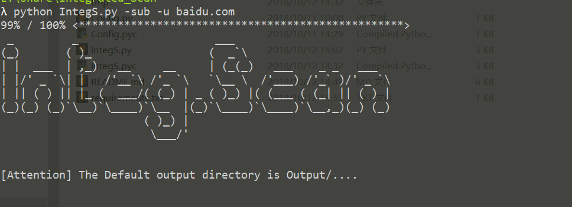
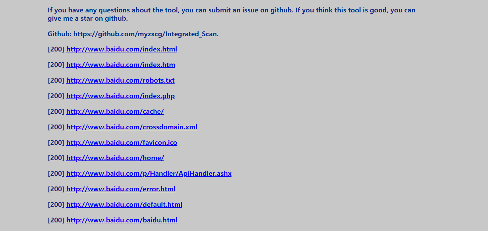

### 简介

信息收集扫描器，主要分为子域名扫描、端口扫描、和敏感目录爆破。各个模块均能单独运行,也能协同工作,尽可能增大你对目标信息的获取程度。

在端口扫描方面,感觉nmap扫描很慢,所以使用多进程+协程 提升扫描效率 经过和nmap速度对比 效果显著

感兴趣可[点击链接](https://myzxcg.github.io/20180920.html) 了解开发思路. 如有bug或问题 请提交issue 我会尽快修复

**最近更新:**

增添html输出格式 直接点击链接 不用再复制粘贴了

### 依赖包下载:

>
    pip  install -r requirements.txt

**Tips:** 

运行报错就是没有执行这条命令

### 更新记录:
- [2018.7.14]
	- 对nmap扫描模块添加多进程，默认6个nmap进程
- [2018.9.19]
	- 添加子域名爆破百万级大字典 ,优化了文件输出，增加详细使用教程
- [2018.9.20]
	- 子域名爆破添加-s参数 能批量扫描文件内的域名（仅限子域名爆破模块）
	- 添加--re 参数 处理子域名爆破的结果 将域名和ip分开 并将IP重新生成一个C段 可批量处理
- [2018.10.11]
    - 修改命令参数交互方式 使用更方便
    - 支持输出html文件 可直接点击链接 浏览结果不用从txt上复制粘贴到浏览器上访问了
    	

### 用法:

>

	This project was developed by myz.
	Developed with python2.7
	Usage:
	python IntegS.py [module] [sub parameter] target [nmap parameter]	
	Module Type: 模块类型
        Common:
            -sub        Blasting subdomains 爆破子域名
            -nmap       Port scanning for ip 端口扫描
            -dirscan    Blast scan the web directory 目录爆破
 	    Advanced:
            -subn       Blasting subdomains and Port scan 子域名+'对ip进行扩大处理'+端口扫描
            -all        a complete moudle,contain subdomain,namp_scan and dirscan 子域名+'对ip进行扩大处理'+端口扫描 + '对子域名进行目录爆破'
	args:
	  -h, --help   show this help message and exit
	  #sub module
	      -u HOST/DOMIN Port scan ip/Ip segment or subdomain 指定扫描的子域名或者端口扫描的ip或者ip段
          -t THREADS    sub Blasting module's threads,default=200 指定子域名扫描协程,默认200协程
          -p PROCESS    sub Blasting and PortScan module's Processes,default=6 指定子域名扫描进程,默认6进程
          -r File_Ip_Domain Specify the target domain file 指定域名文件 批量扫描域名 的子域名
          -f DICTFILE   subdomain's file,default is subnames.txt 指定子域名爆破字典文件 默认为subnames.txt
          -o OUTPUT     Output filename  指定子域名结果文件名
          -i            Ignore domains pointed to private IPs 忽略内网ip
          --full        sub Blasting complete dictionary 使用百万级的子域名扫描字典,时间较长
          
      -re dealsub      Process the subdomain name blast result file, separate the subdomain name from the IP, and 
                        regenerate the IP into a C segment 处理子域名爆破模块的结果文件，将子域名和IP分开，并将IP重新生成一个C段，可批量处理
	  #nmap module
          -u HOST/DOMIN Port scan ip/Ip segment or subdomain 指定扫描的子域名或者端口扫描的ip或者ip段
          -r File_Ip_Domain    read Port scan ip file 指定端口扫描的文件 文件格式和nmap相同
          -o OUTPUT     Output filename 指定端口扫描结果的文件名
	  #dirscan module
          -d DICT_DIR   dirscan dict file,defalut Dict/dict_dir.txt 指定目录扫描所用的字典路径
	  #subn module
	      This module does not support the -o parameter 这个模块不支持-o参数
	      example:
	        python IntegS.py -subn [sub parameter] -u target
	  #all  module
	      This module does not support the -o parameter 这个模块不支持-o参数
	      example:
	        python IntegS.py -all  [sub parameter] -u target
	      
**Tips:**

nmap 的参数信息 在config.py中指定 默认以sS方式扫描

扫描结果默认生成Output/xxx.txt和Output/xxx.html两个文件

### 结果截图

敏感目录扫描结果

端口扫描结果

##### sub方式 子域名爆破模块

>python IntegS.py -sub -i --full -o xxx.txt -u baidu.com 

扫描百度的子域名 忽略内网ip 使用完全字典扫描 内容输出到Output/xxx.txt和Output/xxx.html

>python IntegS.py -sub -i --full -o xxx.txt -r domain.txt

批量扫描domain.txt内的子域名 忽略内网ip 使用完全字典扫描 内容输出到Output/xxx.txt和Output/xxx.html

>python IntegS.py -re baidu.com.txt,qq.com.txt 

将百度 qq的子域名爆破生成的结果 进行处理 将域名和ip分开 并将IP重新生成一个C段 生成两个文件
Output/deal_sudomain.txt & Output/deal_iplist.txt

##### nmap方式 nmap扫描模块

>python IntegS.py -nmap -u 192.168.1.1/24

扫描一个c段，nmap 的参数信息 在config.py中指定,默认以sS方式扫描

>python IntegS.py -nmap -r ip.txt -o ip_done.txt 

读取存储ip的文件进行扫描,结果输出到ip_done.txt文件中

##### dirscan方式 目录爆破模块

>python IntegS.py -dirscan -u baidu.com

 对百度进行目录爆破

##### subn方式（子域名爆破+nmap扫描）

>python IntegS.py -subn -u baidu.com

##### all方式（子域名爆破+nmap扫描+目录爆破）

>python IntegS.py -all -u baidu.com

### 参考:

子域名爆破模块参考[lijiejie/subDomainsBrute](https://github.com/lijiejie/subDomainsBrute)项目

